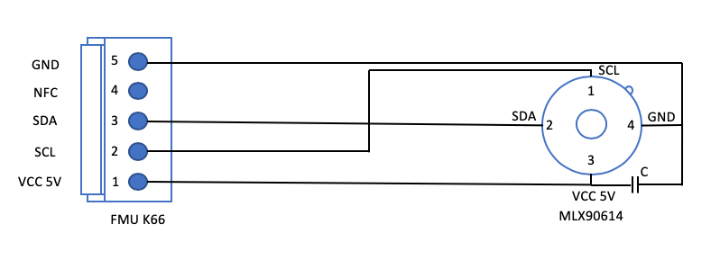

# Melexis MLX90614 IR sensor

## Installing the sensor

How to install and commission the MLX90614 you can find in the [datasheet](https://www.melexis.com/en/documents/documentation/datasheets/datasheet-mlx90614). You can connect the sensor at the "I2C/NFC" connector on the FMU.



In the picture above the assembly of the sensor is shown. Solder the pre-assembled cable for the FMU connector with the sensor to a small breadboard and plug the other ends of the cables into the connector as shown. For better power stability, you can attach a capacitor between Vdd and ground.


The MLX90614 has an I2C and a PWM protocol. Per default the I2C protocol is activated. Switching between the modes is described in the [datasheet](https://www.melexis.com/en/documents/documentation/datasheets/datasheet-mlx90614) on page 29.


## Example code

Example code for using the MLX90614 under PX4 is available under the NXP HoverGames GitHub:



The example was written in C++ and is based on the "px4\_simple\_app" in the examples folder of the PX4 Firmware. This example is in the folder "hg\_mlx90614" and includes the files "CMakeLists.txt", "hg\_temp.h" and "hg\_temp.cpp".

For running the example the command __`hg_mlx90614` has to be added under the keyword "EXAMPLES" in the file "_default.cmake"_  from the folder "_.../src/Firmware/boards/nxp/fmuk66-v3" ._ Also copy the folder "hg\_mlx90614" in the folder "_.../src/Firmware/src/examples"._

Within the example there are two public functions for reading the object temperature and the ambient temperature. These will be called as follows:

```csharp
HG_Temp temp;
double objectTemp = 0;
double ambientTemp  =0;

objectTemp   = temp.readAmbientTempC();
ambientTemp  = temp.readObjectTempC();
```

First creating an object of the "HG\_Temp"-Class. Then you can call the functions for reading the temperature. Both functions `readAmbientTempC` and `readObjectTempC` returns the temperature as a double type in degrees Celsius.

