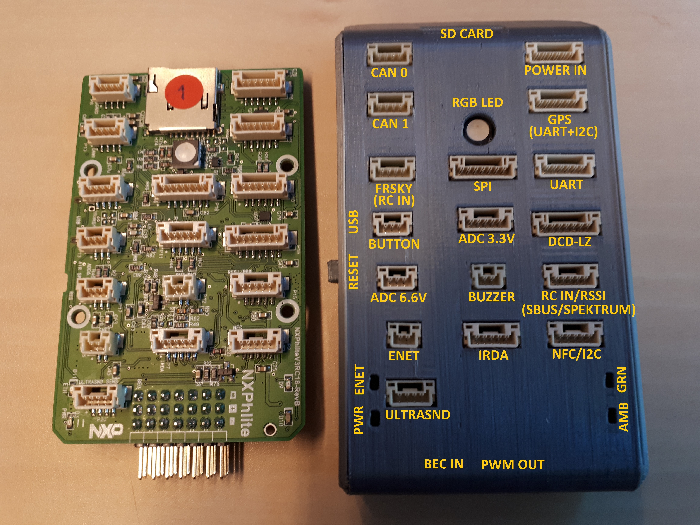
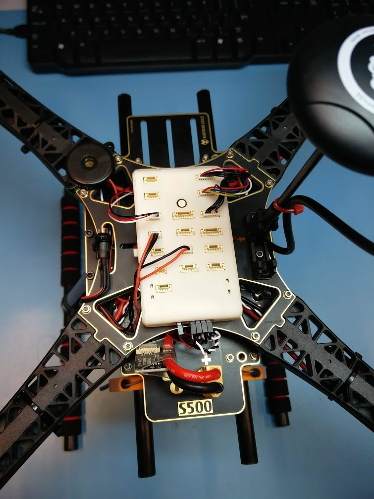
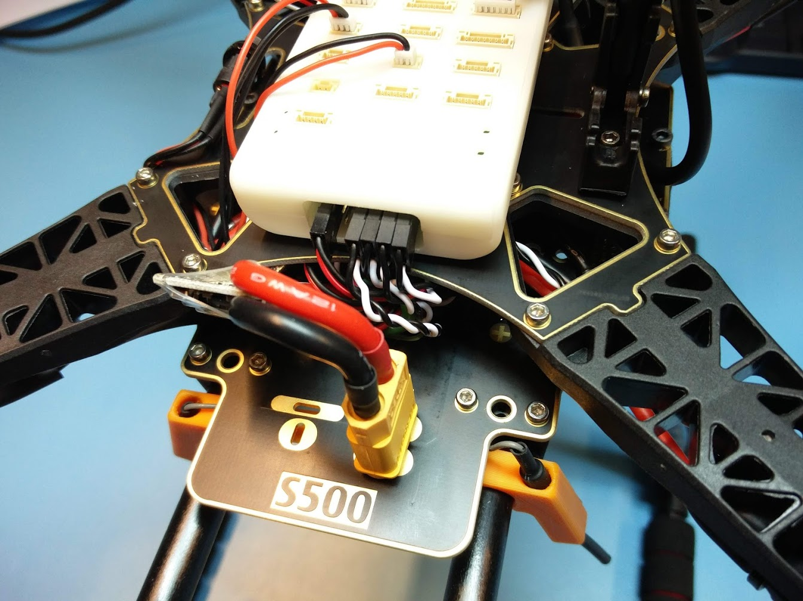
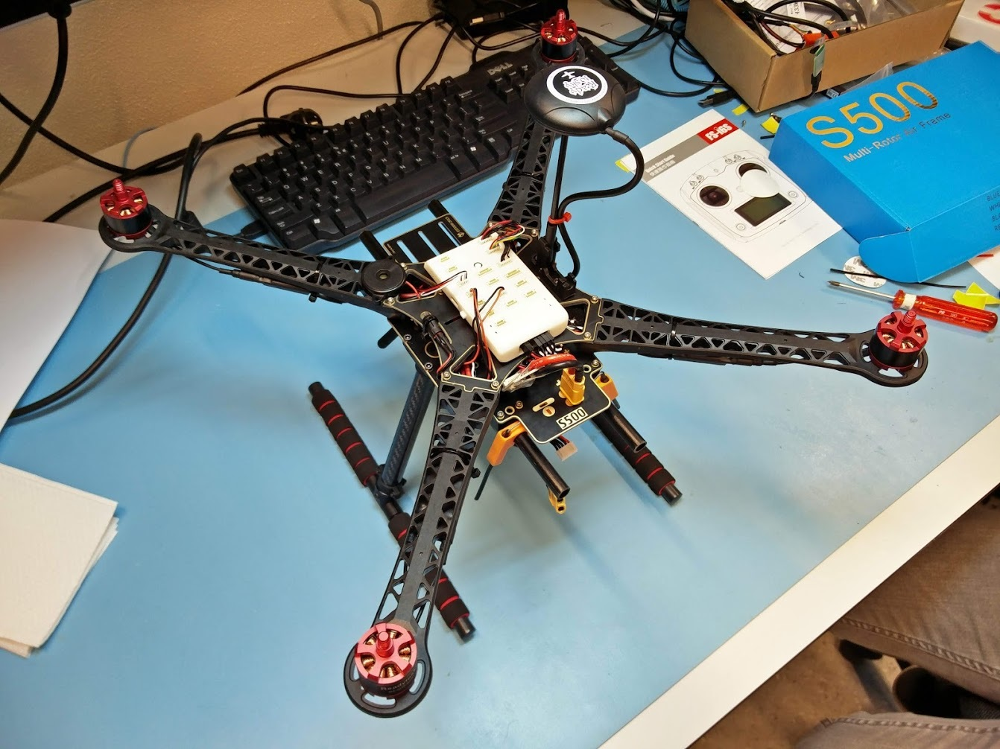
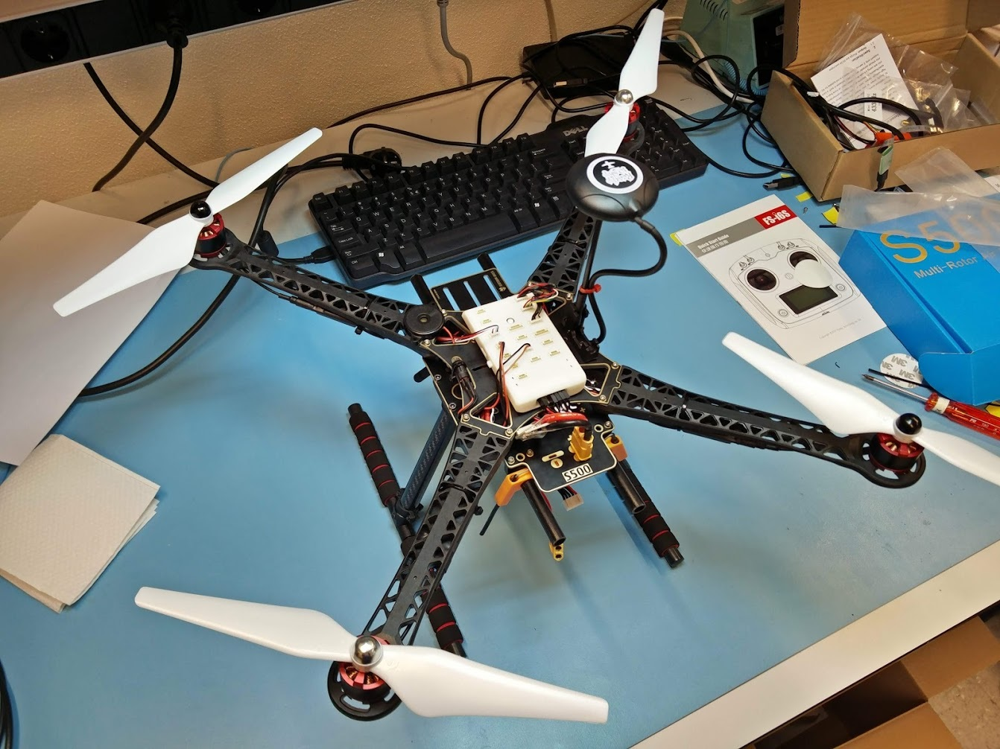

# Connecting all FMU wires

## Connector pinout

We are almost ready. We only need to connect the wires to the right connectors on the FMU. A diagram showing all port locations is available below. [More indepth information](../../rddrone-fmuk66/connectors/) is also available in the technical reference section.

The power module plugs into the XT60 connector at the back of the drone. Its other end should go through the hole in the bottom plate. The battery can be connected to this end later. The smaller cable coming from the power module should go between the two plates and come out near the front of the FMU. This 6-pin connector plugs into the POWER IN connector.

The 6-pin GPS cable should go to the GPS connector just below the POWER IN connector. Below this is a 6-pin UART connector, to which the telemetry radio cable should be connected.

On the left side of the FMU we have the 4-pin FRSKY/RC IN connector, which is meant for the receiver of the radio controller. Below it is a 3-pin connector for the safety switch. In the middle of the board is a 2-pin connector for the buzzer.

## Servorail

The servorail pinout is shown in the diagram below. The BEC should be connected to the leftmost pins. The ESCs should be connected to the first four sets of pins on the right side.

The order in which the ESCs should be connected to the servo rail is given by the diagram below. The motor/ESC at the front-right should be the first, the one at the back-left should be second. The motor/ESC at the front-left should be third, and the one at the back-right should be fourth.

The black \(ground\) wires should be on top, the white \(signal\) wires on the bottom. The BEC doesn't have a white wire, but it has a red wire, which goes in the middle. It will provide 5V power to all middle pins. However, the ESCs included in the HoverGames kit already receive power directly from the PDB and therefore don't have a wire that connects to the middle pins of the servo rail.

The drone should now look similar to the picture below.

## Final result

Finally, you can use some zip ties to make sure the propellers won't cut through any loose wires. You could already install the propellers, but you might have to remove them again later. The clockwise rotating motors \(with a mark on top\) have propellers with black nuts, the counter clockwise rotating motors have propellers with silver nuts.


When you are setting up the software you should take the propellers off for your own safety. It is a good idea to only have the propellers installed when you are ready to fly. Also have a look at our section about [flying safely](../../userguide/flying/).


