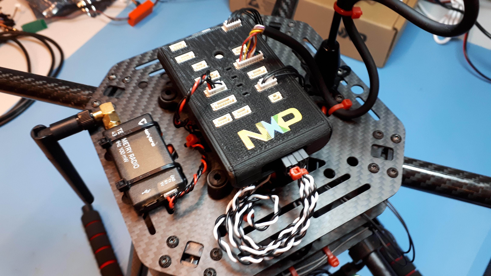
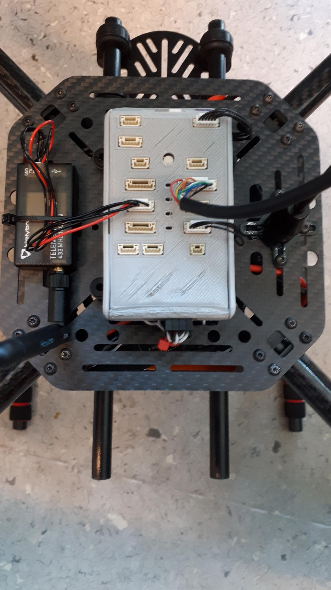
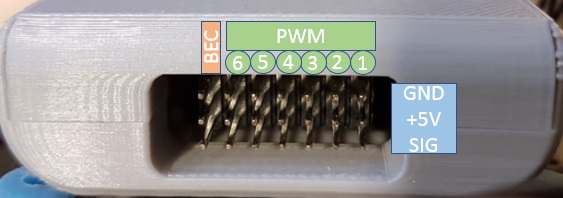
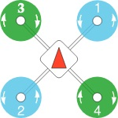
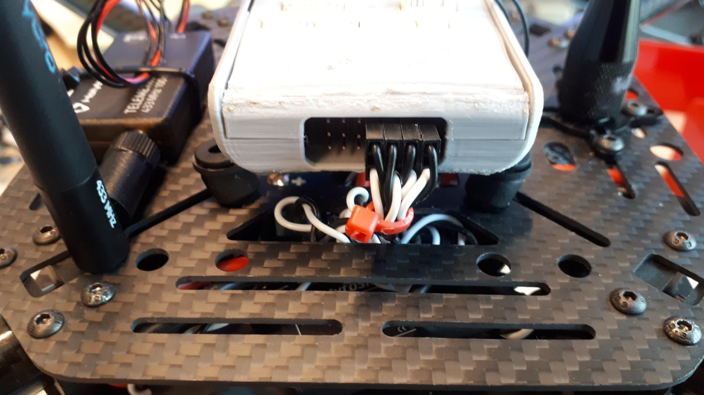
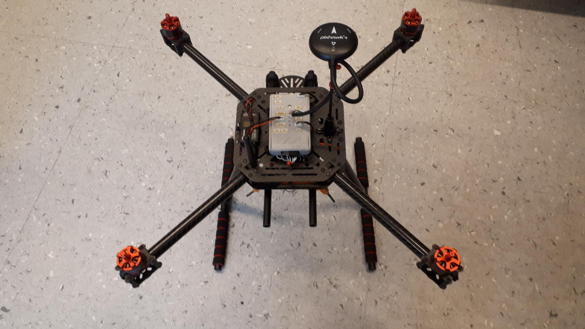
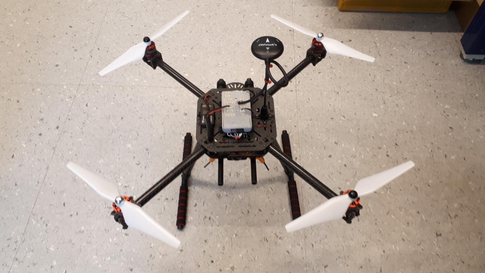

# Connecting all FMU wires

## Connector pinout 

We are almost ready. We only need to connect the wires to the right connectors on the FMU. A diagram showing all port locations is available below. [More indepth information](../../rddrone-fmuk66/connectors/) is also available in the technical reference section.



There are four connectors that you should plug in. The 6 pin POWER IN connector at the top right. Below that is the 10 pin GPS connector. On the left side is the 6 pin TELEM connector for the telemetry radio. And below the GPS there is also the 5 pin RC IN connector for the RC receiver.



## Servorail

The servorail pinout is shown in the diagram below. If you have a BEC \(not included in the standard HoverGames kits\), it should be connected to the leftmost pins. The ESCs should be connected to the first four sets of pins on the right side.


The +5V rail can only be powered with an **external BEC** \(not included\). The FMUK66 itself does not provide any power to these pins.


The order in which the ESCs should be connected to the servo rail is given by the diagram below. The red arrow indicates the front of the drone. Because the ESCs are mounted in a very tight space, it might be hard to find which wire is coming from which ESC, and which ESC is connected to which motor.

If you followed the assembly instructions on the previous pages, the position of the ESCs should correspond to the table below. If you are not sure if you followed the previous instructions correctly, you might want to have a good look at where the wires are going, and write down which motor they control.

| Motor number | Motor position | ESC position | PWM wire coming from |
| :--- | :--- | :--- | :--- |
| 1 | Front right | Right | Back right |
| 2 | Back left | Left | Front left |
| 3 | Front left | Front | Front right |
| 4 | Back right | Back | Back left |

When inserting the connectors to the servorail, the black \(ground\) wires should be on top, and the white \(signal\) wires on the bottom. The BEC doesn't have a white wire, but it has a red wire, which goes in the middle. It will provide 5V power to all pins in the middle row. However, the ESCs included in the HoverGames drone kit already receive power directly from the PDB and therefore don't have a wire that connects to the middle pins of the servo rail.

At this point, the drone should look similar to the picture below. 

## Final result

Finally, you can use some zip ties to make sure the propellers won't cut through any loose wires. You could already install the propellers, but you might have to remove them again later. The propellers with black nuts go on the clockwise rotating motors \(with a notch on the shaft\), the propellers with silver nuts go on the counter clockwise rotating motors.


You probably still have the extension cables coming out of the carbon tubes. Unless you have already verified that all motors are rotating in the right direction, you should leave it like that for now. You can put the wires into the tubes later, after spinning the motors for the first time.



You should **insert the microSD card** into the FMU if you haven't already done so!



When you are setting up the software you should take the propellers off for your own safety. It is a good idea to only have the propellers installed when you are ready to fly. Also have a look at our section about [flying safely](../flying/).


