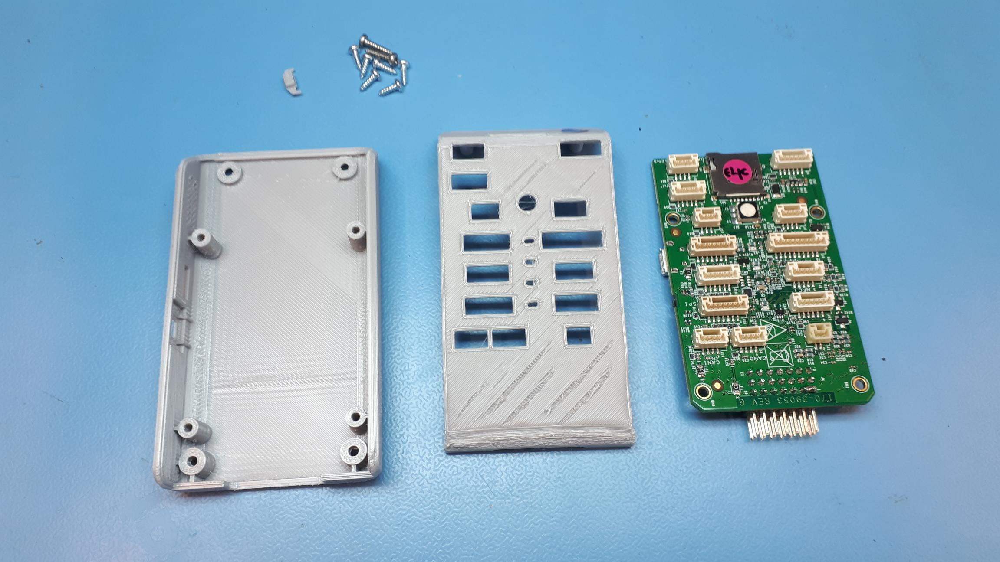
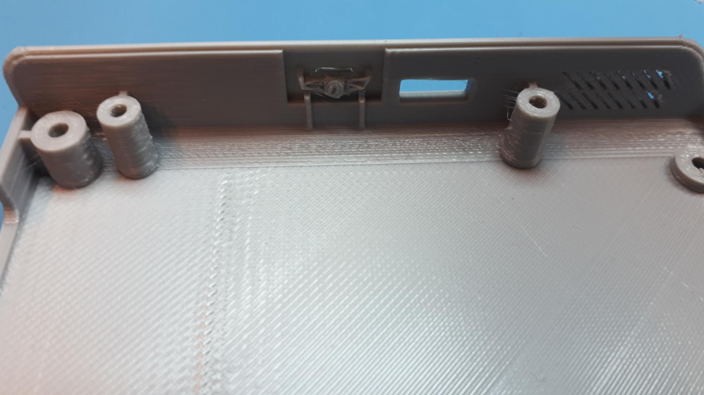
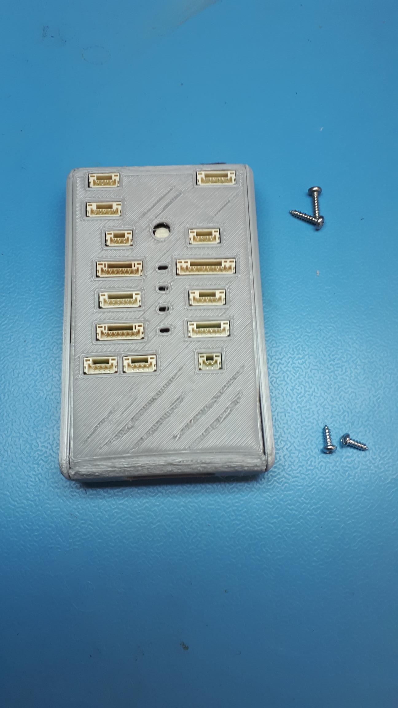
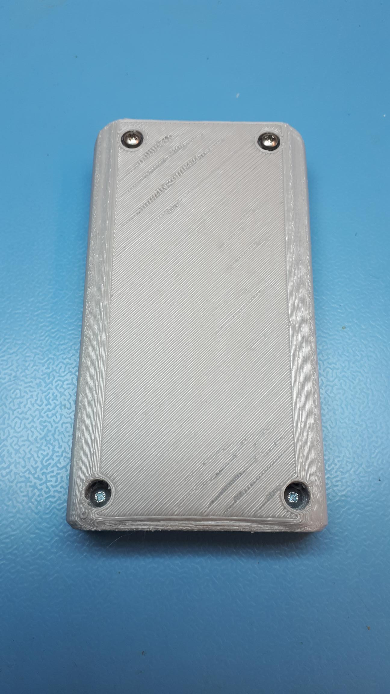

# FMU enclosure

The FMU comes with a 3D printed enclosure, which still has to be assembled. It consists of a top part, a bottom part and a tiny reset button. 


It could be that the FMU board still has stickers on top of its connectors. You should take them off before you put the FMU inside the enclosure.



You might notice that **two pins on the PWM servorail of the FMU are shorted**. This is intentional. Due to a mistake, the rightmost GND pin on the PWM servorail was not not actually connected on the PCB. This was fixed by shorting it to the GND pin next to it. This will be corrected on future boards, but it is completely fine if you see these two pins shorted together on your board.




First, make sure the reset button is installed inside the enclosure. It should fit in a hole in the side, next to the hole for the micro USB connector.

Now, the FMU can be installed into the bottom part of the enclosure with four short screws \(7 mm\). It could be the case that you only have one type of screw with your case, which is fine as well. Just use four of the included screws and be gentle when tightening them.

After the FMU is installed into the bottom part, you can put the top part on and turn the whole enclosure upside down. You need two short screws \(7 mm\) and two longer screws \(about 10 mm\) to keep the two halfs together. The short screws should go in the holes close to the servorail of the FMU. The longer ones go in the holes near the SD card slot. Again, if you have only one type of screw with your case, that is fine as well. Just be gentle when tightening the screws.


Once the FMU is inside the enclosure, you should **insert the microSD card**! Flight log data will be kept on this SD card and it contains very useful information for analyzing flight performance. It's also a very nice tool when you are having issues, the logs might provide some hints about what is going on.


