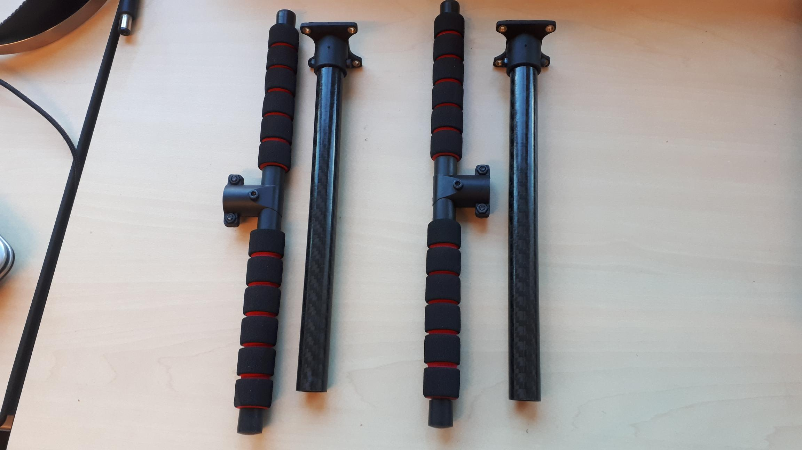
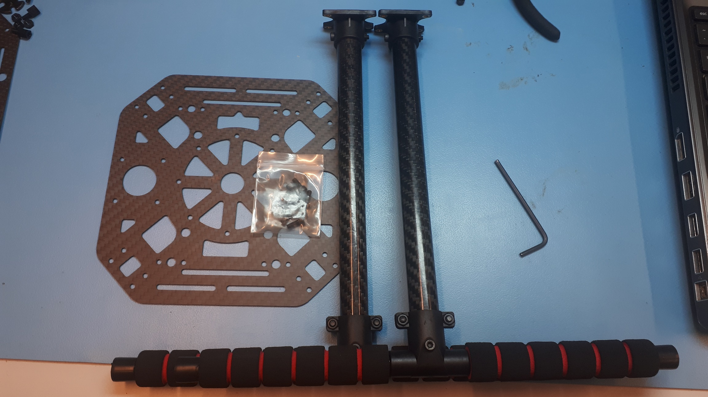
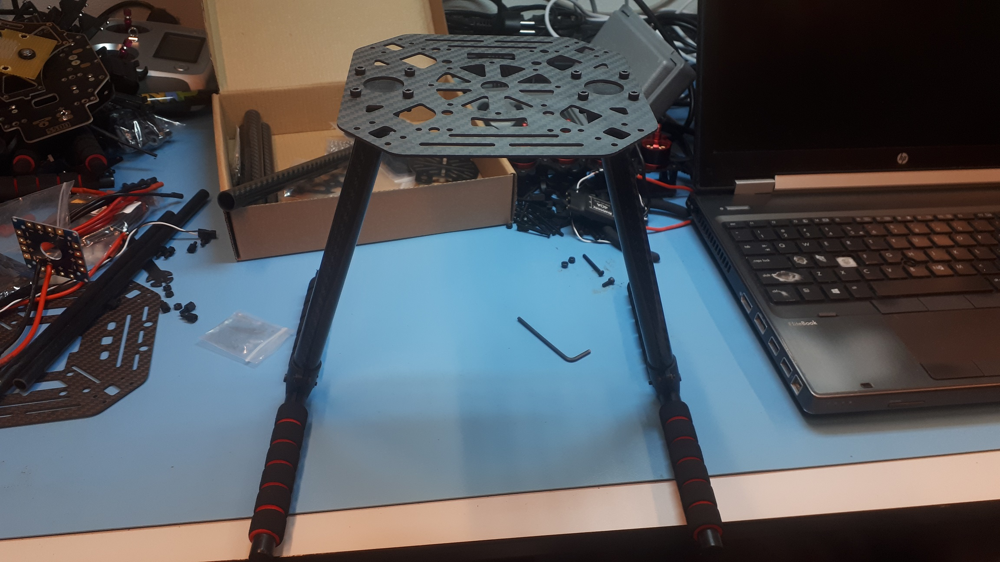
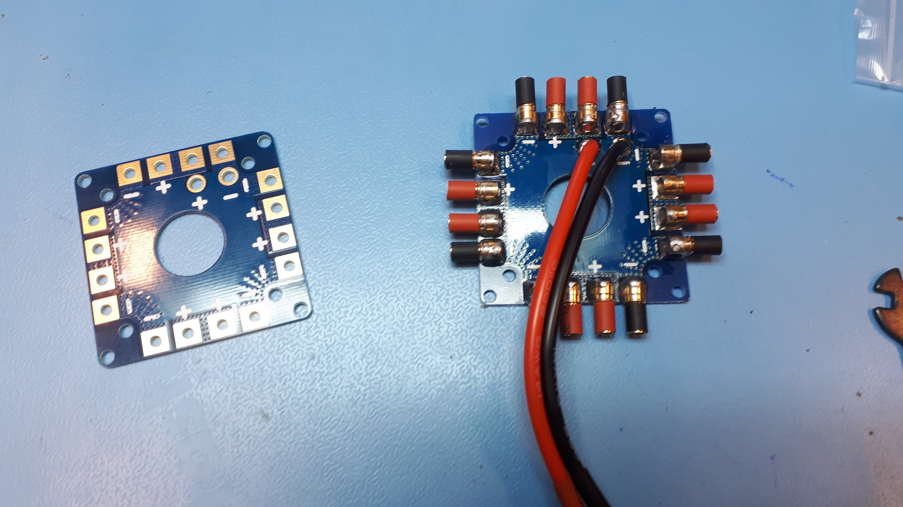
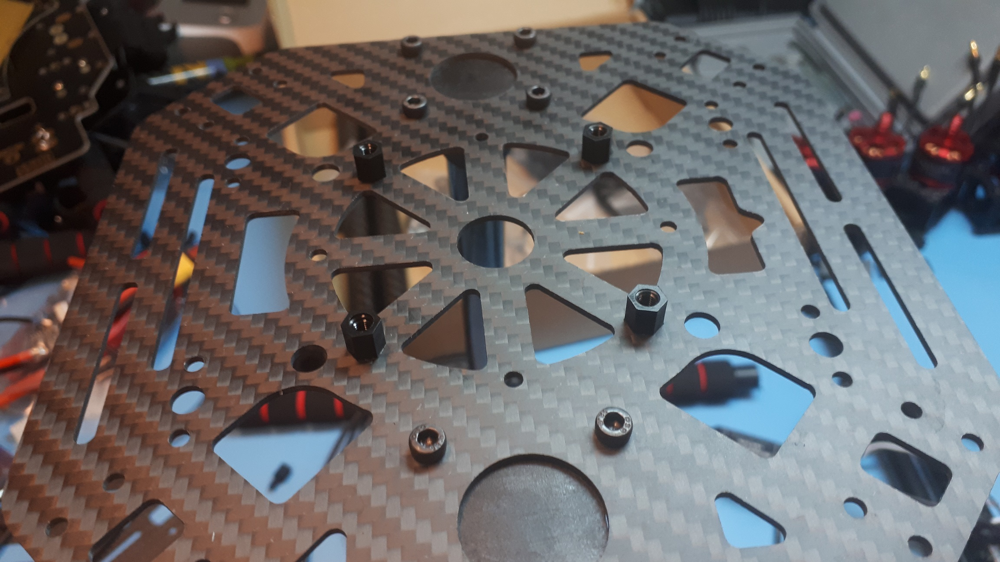
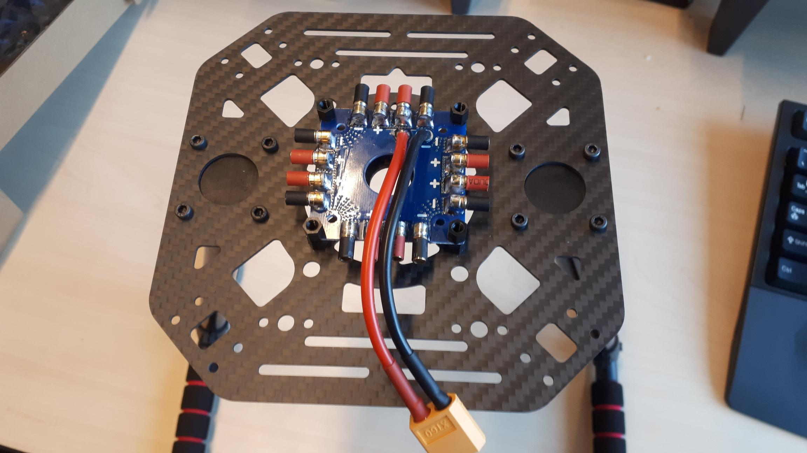
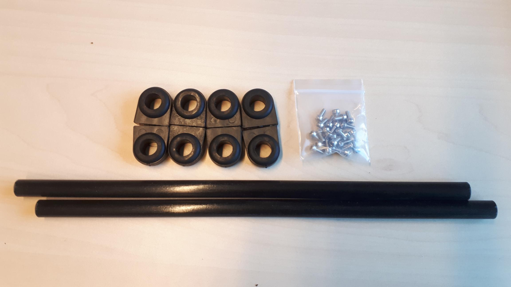
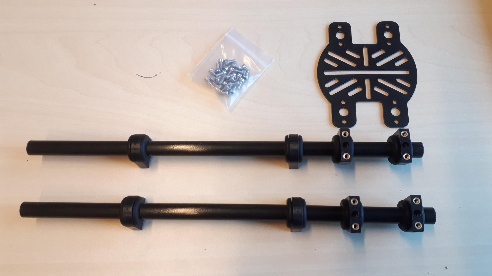
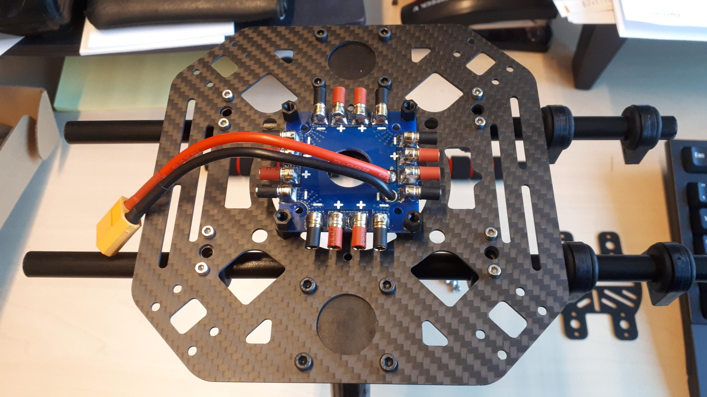
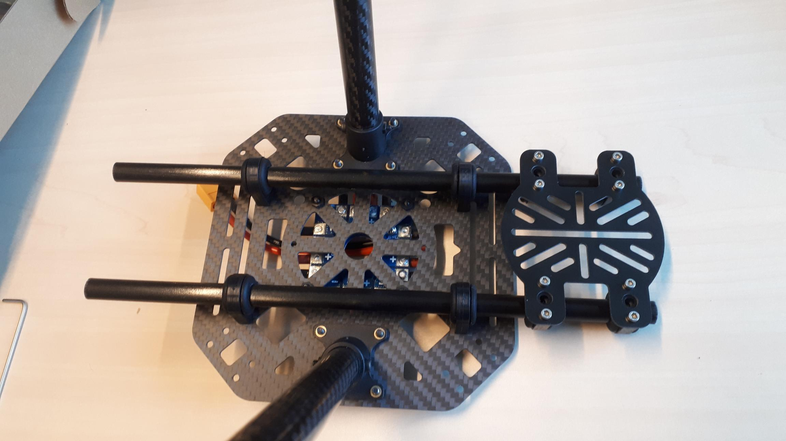

# Landing gear, PDB and rails

## Landing gear

Each leg consists of two parts. The first is the horizontal part with the T-connector and foam protection. The second is the carbon fiber tube with the connector that can be mounted to the frame.

Begin by loosening the two hex screws on the side of the T-connector. You should now be able to put in the carbon fiber tube. Once it is inserted, you can tighten the two screws again. Do this for both legs.



Next, we will need the bottom plate of the frame. It is one of the two plates with the cut out areas as shown above. The bottom plate is the one with the circle shaped holes in the middle and on the sides, we will put the other one on top. Around the two circle shaped holes on the sides, there are four small holes for screws. The black M3 socket head cap screws go down these holes, and should screw directly into the leg mounts. Nuts are not needed for this part.


The T-connector is vulnerable to cracking with hard landings. We have found that adding a zip tie around the connector can help protect it. Alternatively, an extra-strong 3D printable T-connector and leg mount can be found in the [replacement parts section](../replacement-parts-alternatives-and-upgrades/3d-printable-parts.md#replacement-landing-gear-including-t-connector).



Also consider using a **threadlocking adhesive** such as Loctite 243 for the legs. At the very least, check them regularly to make sure that there aren't any loose screws. Flight performance can be significantly decreased by a loose landing gear.


## Installing the PDB

Next, we will install the power distribution board \(PDB\) onto the bottom plate. You should have a pre-soldered board included with your kit. It already has small connectors for your ESCs. It also has a yellow XT60 connector for the FMU power module \(and battery\).

There should be nylon spacers and nuts included with the unsoldered PDB. We will install four of these spacers on top of the bottom plate. We will then use the remaining four spacers to keep the PDB in place.

There are eight holes for screws distributed in a circle around the center of the bottom plate. We will use the "diagonal" holes, so not the holes that are closest to the legs or the front/back of the plate. Put a spacer through from the top, and use a nut to keep it in place. It should be fine to tighten them by hand, it is not necessary to use the wrench.



You can now put the PDB on top, and use the other four spacers to keep the PDB in place. The orientation of the PDB does not matter a lot, but the XT60 connector should go through the larger hole at the back of the frame. We define the front of the drone as the side to which the weirdly shaped hole "points". Also see the picture below.

## Rails

The next step is installing the rails. Other plates and components can easily be attached to them. These rails are a defacto standard of 60 mm spacing with 10 mm carbon fiber tubes, and you can find several 3D printable mounts which fit.

We have to install these rails now, because after the other components are installed the screws will be very difficult to get in place. We need the two 10 mm carbon tubes, the two plastic bags with tube mounts and rubber rings, and the small M2.5 screws. There is also a smaller carbon fiber plate included, typically used for camera mounting, that we will put on these rails.



First things first, put the rubber rings through the tube mounts, as shown in the picture below.


While there are multiple techniques possible to assemble this section, we have found the following method to be most convenient. 


You can now gently slide these tube mounts onto the carbon rods. We found that this is easier than first installing the tube mounts on the bottom of the frame, and then forcing the carbon tube through them.

Slide the tube mounts on the carbon tube, such that on one side the screw holes in the tube mounts align with the holes in the big bottom plate of the drone. On the other side, the holes should match with the small plate. Also see the picture below.

We can now easily mount this onto the bottom plate, using either the small M2.5 socket head cap screws. The screws go down from the top, and should screw directly into the tube mounts. The extra tube mounts for the small plate should be at the front of the drone.

Finally, you can also mount the small plate. You either need the same M2.5 screws or the small countersunk screws that are included in newer kit. This plate could be used to mount a camera gimbal. Note that there is no camera or gimbal included in the drone kit.


It might also be useful to apply a **threadlocking adhesive** \(such as Loctite 243\) to the screws for the rails and connected plates. In any case make sure to check the screws regularly, especially if you have any payload attached to these rails \(such as a camera module\).


