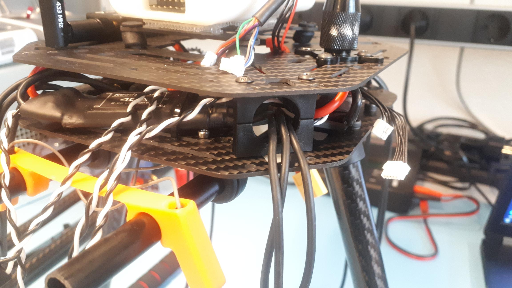
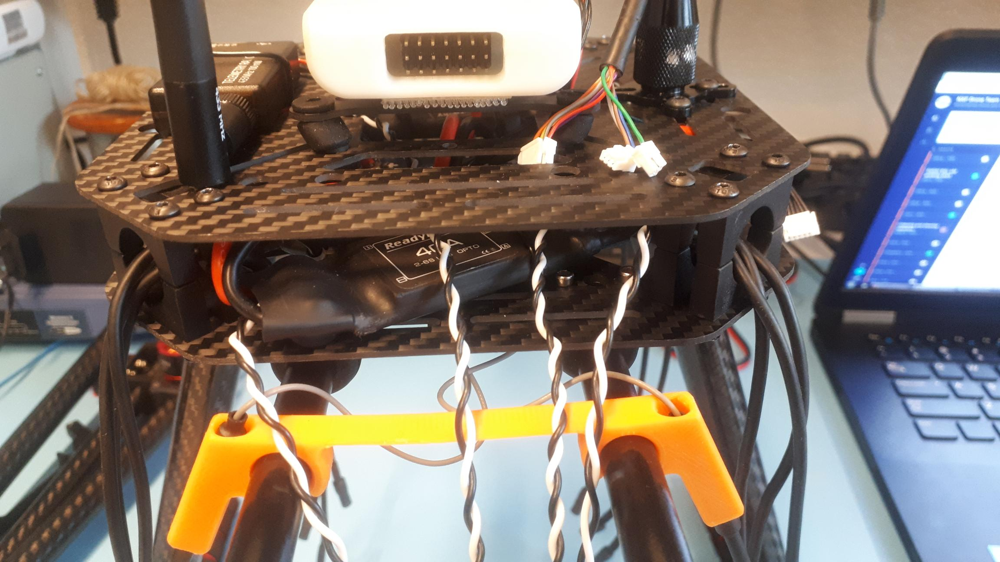
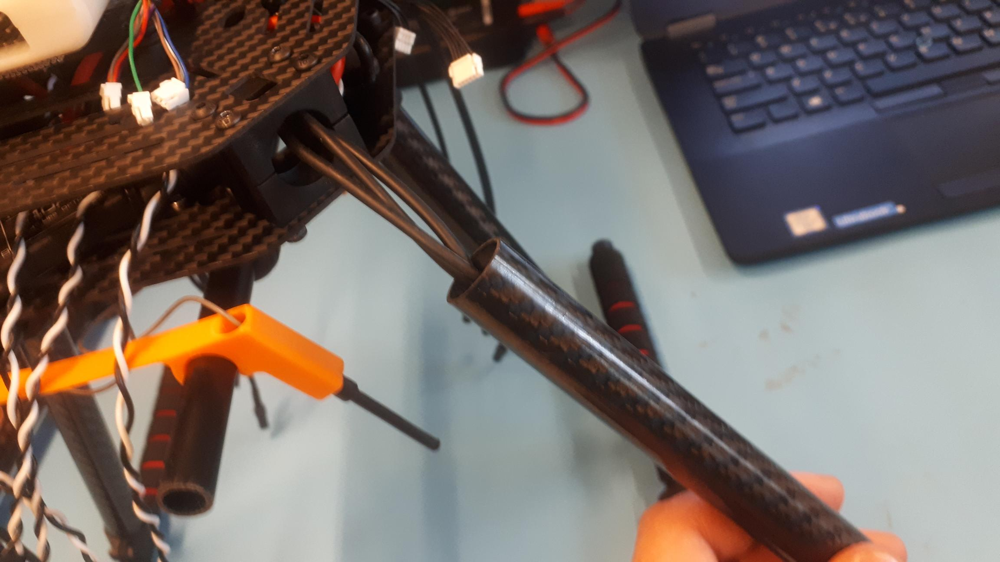
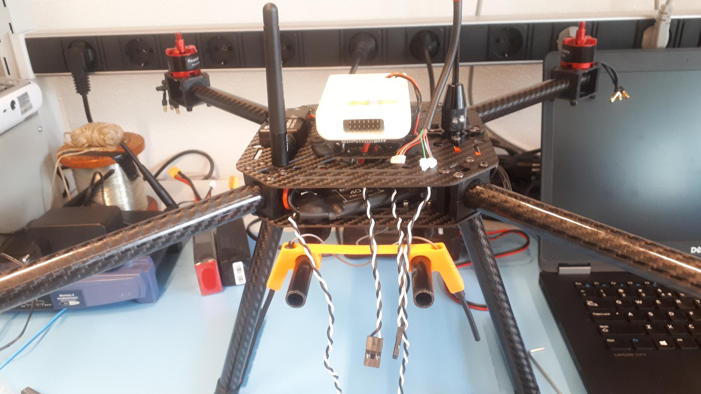

# Mounting the top plate and arms

## Installing the top plate

We will first install the top plate and the tube clamps, in between which the carbon tubes will be kept in place. These are the same tube clamps as used for the motor mounts.

It's easiest to put the plate on top of the ESCs, it should be fairly level. Then, start on one side. Put two tube clamps in between the plates, put the screws through and put the nuts on by hand. You don't have to tighten them with a wrench yet. Make sure the three extension cables coming from the ESC are put through the middle.


Before you put the top plate on, it is convenient to pull al signal cables coming from the ESCs \(black and white\) to the back. If possible, already pull them through the gap in the top plate below the servorail of the FMU.

Also, you should try to pull the cable coming from the RC receiver through the gap underneath the FMU, from the the right side. The cable coming from the FMU power module should go through the gap in front of the FMU. 

It will be a lot easier if you do this now, the cables might be hard to access when everything is in place.




Repeat this seven more times, until in each corner you have two sets of tube clamps. Make sure the ESC extension cables are routed through the holes in between the clamps.

## Installing the arms

When we first put together the arms, it was explained that there are clockwise rotating motors and counter clockwise rotating motors. At this point, you have to be careful. You have two arms with a clockwise \(CW\) rotating motor \(with a notch on top of the shaft\), and two arms with a counter clockwise \(CCW\) rotating motor \(flat top\).


Absolutely make sure you have the right motors in the right spot. The threading on the shafts of the motors matters, you will only be able to install CW propellers on a CW motor shaft. 




The motors should be mounted according to the following diagram. The CW rotating motors with a notch should go on the front left and back right of the drone. The CCW rotating motors without this notch should be on the front right and back left. 

If we look at the figure above, the green motors \(3 and 4\) should have a notch on top of their shaft. The shaft of the blue motors \(1 and 2\) should have a flat top.

Once you are absolutely sure that you have the right arm, you can put the extension cables inside of the tube, and put the tube it in between the clamps. On the inside, make sure the carbon tube aligns with the clamps. It's also okay if it slightly extends beyond the clamps, then just make sure this is the case for all four arms.

Make sure the motor is pointing upward and is not askew. You can then tighten the screws that go through the tube clamps, using a hex key and a wrench. Repeat this process for all four arms. Make sure at all times that you use an arm with a motor that is made to rotate in the right direction!

## Plugging in the motors

The extension cables should come out slightly at the end of the arm. You can plug in the motor wires, the order does not really matter. However, if the motor happens to be turning the wrong direction \(note that this is independent of whether the motor is SUPPOSED to rotate that way\), you only have to swap two of the wires, and it should then rotate in the other direction.



It's best to leave the cables like this for now. After you have been able to run the motors for the first time, you can verify whether all motors are rotating in the right direction, and change the cables if necessary. After that, you can push them inside the carbon fiber tube. You might have to pull gently from inside the frame. It can be a bit hard to access, but you can also use some pliers, as long as you are careful.

